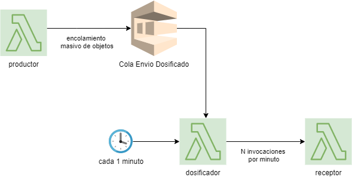

# Envío Dosificado

## Descripción

Este patrón define un mecanismo de procesamiento dosificado de objetos masivos. Dado un conjunto de objetos, el mecanismo permite procesar subconjuntos de objetos por minuto. Un caso de uso es invocar una API externa que puede atender una cantidad acotada de transacciones por minuto.



## Mecanismo

El mecanismo consiste en los siguientes pasos:
- Un productor va encolando objetos en una cola de envío dosificado.
- Una lambda dosificadora es invocada cada 1 minuto y desencola mensajes. Esta lambda tiene 2 parámetros: una cuota *N* que corresponde al máximo de invocaciones por minuto y una cantidad *M* que corresponde a la cantidad de objetos que envía en cada invocación.
- Entonces, cada 1 minuto el dosificador invoca de manera asíncrona una cantidad *N* de veces a una lambda receptora pasando en cada invocación un numero *M* de mensajes.
- La lambda receptora recibe entonces *M* mensajes y los procesa.

## Implementación

Se implementó un ejemplo de implementación del patrón que está disponible en el repositorio git [ejemplos-patrones](https://console.aws.amazon.com/codesuite/codecommit/repositories/ejemplos-patrones/browse?region=us-east-1). A continuación damos una descripción.

El siguiente código corresponde al productor. Está implementado como una lambda que encola un gran número de objetos.

<!--
title: "productor.js"
lineNumbers: true
-->
```js
let SQS = require('aws-sdk/clients/sqs');
let sqs = new SQS({ region: 'us-east-1' });

let AMOUNT = 200;

module.exports.handler = async(event) => {
    for (let i = 0; i < AMOUNT; ++i) {
        await sqs.sendMessage({
            MessageBody: JSON.stringify({
                key: `key-${Math.random()*AMOUNT}`,
                value: `value-${Math.random()*AMOUNT}`
            }),
            QueueUrl: process.env.QUEUE_URL
        }).promise()
    }
};
```

La siguiente lambda implementa al dosificador, el cual utiliza una estrategia de consumo de la cola que esta implementada en la libreria *tgr-sdk/clients/queue-workers* la cual se incluye a través de un layer.

<!--
title: "dosificador.js"
lineNumbers: true
-->
```js
const { DosificadorQueueWorker, DosificadorChannelTypes } = require('tgr-sdk/helpers/queue-workers')

const N = 60;
const M = 5

let worker = new DosificadorQueueWorker({
    queueURL: process.env.QUEUE_URL,
    perMinute: N,
    perInvocation: M,
    channel: {
        type: DosificadorChannelTypes.LAMBDA,
        lambdaName: process.env.FUNCTION_NAME
    }
})

module.exports.handler = () => {
    worker.dequeue()
}
```
La siguiente imagen muestra el código del receptor, que para este ejemplo solo imprime el objeto recibido. Acá es donde se debe implementar el procesamiento que puede, por ejemplo, corresponder a la invocación a una API externa.
<!--
title: "receptor.js"
lineNumbers: true
-->
```js
let handler = (mensajes) => {
    console.log('numero mensajes recibidos', mensajes.length)
    console.log('ejemplo mensaje', mensajes[0])
}

module.exports = {
    handler
}
```

El siguiente código muestra la configuración usando el framework serverless. 
- Las líneas 10-21 definen los permisos necesarios para las lambdas. Si se trabaja con terraform para definir el rol entonces hay que incluir esos permisos en terraform. 
- En las líneas 38-39 se incluye el layer para ser usado en la lambda *dosificador*. 
- En las líneas 42-43 se define que el dosificador se invoque cada 1 minuto. 
- Entre las líneas 50 y 55 se crea la cola para el envío dosificado.

<!--
title: "serverless.yml"
lineNumbers: true
-->
```yml
service: envio-dosificado

custom: ${file(./config.yml)}

provider:
  name: aws
  runtime: nodejs12.x
  region: us-east-1
  stackName: ${self:custom.prefix}
  iamRoleStatements:
    - Effect: 'Allow'
      Action:
        - 'sqs:sendMessage'
        - 'sqs:receiveMessage'
        - 'sqs:deleteMessage'
      Resource:
        - 'Fn::GetAtt': [ColaEnvioDosificado, Arn]
    - Effect: 'Allow'
      Action:
        - 'lambda:InvokeFunction'
      Resource: arn:aws:lambda:${self:provider.region}:*:function:${self:custom.prefix}-receptor

package:
  exclude:
    - package-lock.json
    - package.json

functions:
  productor:
    name: ${self:custom.prefix}-productor
    handler: src/handlers/productor.handler
    timeout: 60
    environment:
      QUEUE_URL: !Ref ColaEnvioDosificado

  dosificador:
    name: ${self:custom.prefix}-dosificador
    handler: src/handlers/dosificador.handler
    timeout: 60
    layers:
     - ${ssm:/tgr/common/tgr-sdk-layer-arn}
    environment:
      QUEUE_URL: !Ref ColaEnvioDosificado
      FUNCTION_NAME: ${self:custom.prefix}-receptor
    #events:
    #  - schedule: "rate(1 minute)"

  receptor:
    name: ${self:custom.prefix}-receptor
    handler: src/handlers/receptor.handler

resources:
  Resources:
    ColaEnvioDosificado:
      Type: "AWS::SQS::Queue"
      Properties:
        QueueName: ${self:custom.prefix}-envio-dosificado
```

